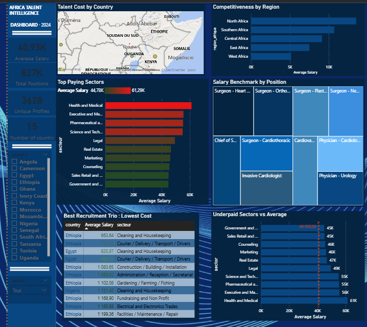

# 📊 Data Analyst Portfolio

**Njouwadjeu Cynthia** | Data Analyst  
Power BI | SQL | DAX | Excel

---

## 🌍 Project 1 : Africa Talent Intelligence Dashboard

**Tool :** Power BI  
**Scope :** Salary analysis across 15 African countries

**Business Questions answered :**
- What is the average talent cost per African country ?
- Which African region offers the most competitive salaries ?
- Which sectors pay their employees the most ?
- What is the salary benchmark by position ?
- Which country/sector/position trio offers the lowest recruitment cost ?
- Which sectors are underpaid compared to the global average ?

📐 [Voir les mesures DAX](./project1-africa-talent/measures.md)

🗄️ [Voir les requêtes SQL](./SQL-Queries.md)

📊 [Voir les datasets](./datasets.md)

---

## 🛒 Project 2 : E-Commerce Dashboard

**Tool :** Power BI  
**Pages :** Performance & Revenue | Customer Segmentation | Loyalty & Satisfaction

**Business Questions answered :**

**Performance & Revenue :**
- What is the total revenue generated ?
- Which city generates the most revenue ?
- Which subscription type is the most profitable ?
- How do sales evolve month by month ?
- Which year was the best performing ?

**Customer Segmentation :**
- What is the customer breakdown by gender ?
- Which age group spends the most ?
- Which customer profile generates the most revenue ?
- Do discounts impact sales ?
- Which city has the highest average basket ?
- Which subscription buys the most articles ?

**Loyalty & Satisfaction :**
- Which subscription type retains customers best ?
- Do satisfied customers spend more ?
- Is there a satisfaction gap between Male and Female customers ?
- Which city has the highest average rating ?
- Do discounts improve customer satisfaction ?
- Is customer satisfaction improving over time ?

[📄 Voir le Dashboard E-Commerce](./dashboard_e_commerce_organized.pdf)

📐 [Voir les mesures DAX](./project2-ecommerce/measures.md)

🗄️ [Voir les requêtes SQL](./SQL-Queries.md)

📊 [Voir les datasets](./datasets.md)

---

## 🛠️ Skills
Power BI | DAX | SQL | Data Visualization | Business Intelligence
